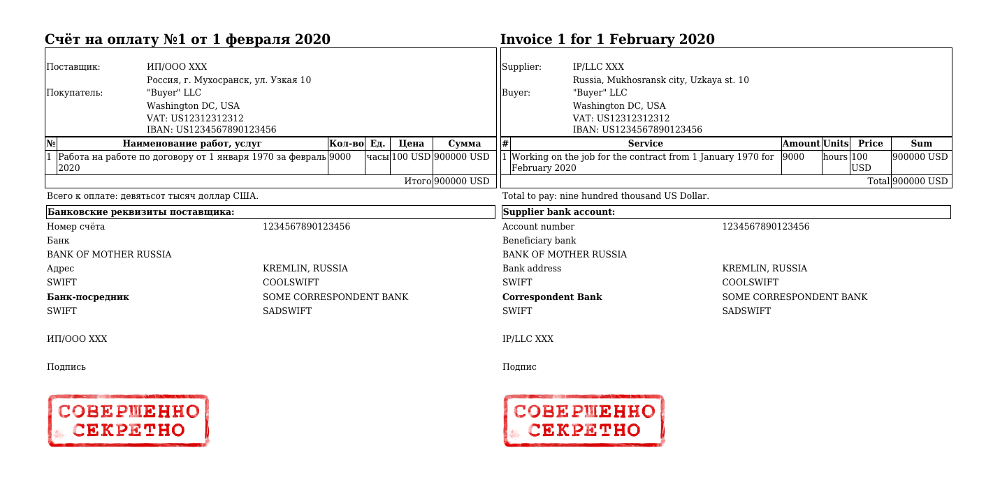

# Bilingual Invoice Generator



[PDF](example/invoice_1_01_02_20.pdf)

## Build

### Install dependencies

```shell
composer install
```

### Create config and translation files

```shell
cp config/parameters.yaml.dist config/parameters.yaml.dist
cp translations/source.yaml.dist translations/source.yaml
cp translations/target.yaml.dist translations/target.yaml
```

## Usage

```shell
# Generate file name
./generate 123 ./

# Use exact file name
./generate 123 ./invoice.pdf

# Set issue date
./generate 123 ./ --issue-date 01.01.1970

# Get help
./generate --help
```
